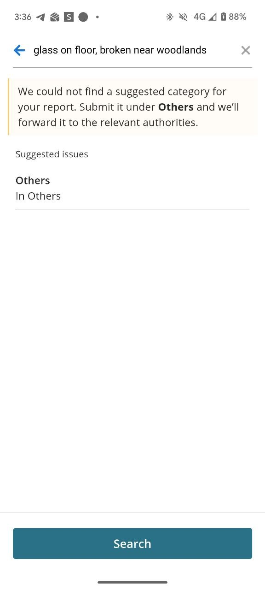

# FixMyEstate SG

FixMyEstate SG is an AI-assisted intake tool for estate and shared-area complaints in Singapore. It turns messy resident text into a structured municipal ticket that an operator can review, complete, and route.

The current build is intentionally small: no login, database, maps, image upload, or agency integration. The core question is whether an LLM workflow can convert incomplete free text into useful first-mile triage.

## Motivation: First-Mile Friction in Municipal Reporting

Singapore already has municipal reporting channels such as OneService, where members of the public can report estate and shared-area issues through predefined categories, buttons, and search.

These flows are useful, but they still rely on the resident knowing how to classify the issue. In my own quick check, searching for a phrase like "broken glass on floor" did not surface a clear matching suggestion and pushed the issue toward a generic "Other issues" path.

OneService App Example:



This is a natural limitation of form-based intake: members of the public should not be expected to know whether an issue is best treated as cleanliness, damaged facility, obstruction, estate maintenance, or safety hazard.

FixMyEstate SG focuses on a narrow AI-assisted intake layer:

> Given a messy resident complaint, can an LLM infer the likely category, urgency, routing team, risk flags, missing details, and follow-up questions before a human reviews the ticket?

The goal is not to replace OneService, but to make first-mile triage more structured and less dependent on perfect user classification.

## Demo Video

Please [**click here to watch the demo video**](https://drive.google.com/file/d/1zJ7i0VfUZit-UW3r7aOPui8XHr0M9620/view?usp=sharing). It covers a full walkthrough of the initial complaint extraction, clarification workflow, and the programmatic evaluation pipeline in action.

## What It Does

The system processes unstructured complaints through a multi-step AI pipeline. Below is an example of the final output: a structured, prioritized ticket ready for an operator to review.


*Example: A completed ticket in the operator queue, populated with extracted categories, risk flags, and clarification answers.*

### Pipeline Breakdown

| Area | Behavior |
| --- | --- |
| Intake | Accepts a free-text complaint from a member of the public. |
| Extraction | Produces a Pydantic ticket with category, urgency, location, routing team, risk flags, confidence, and missing details. |
| Clarification | Always collects detailed location, injury/trapped status, access impact, and timing through fixed controls. |
| Follow-ups | Generates up to three complaint-specific follow-up questions when useful. |
| Finalization | Re-evaluates the ticket after all clarification answers are provided. |
| Guardrails | Identifies gibberish, troll, test, or personal-only incidents as non-actionable instead of inventing a service issue. |
| Review | Shows a ticket queue with attention indicators and an evaluation tab for workflow checks. |

## Why AI

Forms can collect fields, but they do not reliably interpret the operational meaning of messy resident language.

For example:

> "broken glass on the floor near the lift lobby, kids walking past"

This is not just a text description. It may imply a safety hazard, a cleanliness issue, a damaged fixture, higher urgency, and missing details such as exact block, level, whether the area is blocked, and whether anyone is injured.

The LLM is central to three steps:

1. Drafting a structured ticket from the original complaint.
2. Asking targeted follow-up questions for complaint-specific gaps.
3. Re-evaluating the final ticket after clarification answers are provided.

Python is kept for deterministic guardrails: schema validation, routing by category, ticket IDs, status derivation, JSON cleanup, and repeated-field cleanup. The LLM still judges category, urgency, actionability, risk, and missing details.

## Run With Docker

From this project directory, create a `.env` file from `.env.example` and add your API key:

```powershell
Copy-Item .env.example .env
notepad .env
```

Then build and run the app, passing the `.env` file at container runtime:

```powershell
docker build -t fixmyestate-sg .
docker run --rm -p 8501:8501 --env-file .env fixmyestate-sg
```

Open the Streamlit URL, usually `http://localhost:8501`.

Docker does not automatically load `.env` during `docker run`, and this repository deliberately excludes `.env` from the image. The API key must be supplied when the container starts with `--env-file .env`.

If you added or changed `.env` after starting the container, stop the old container and run it again:

```powershell
docker ps
docker stop <container-id>
docker run --rm -p 8501:8501 --env-file .env fixmyestate-sg
```

If the app shows `OPENAI_API_KEY is not configured`, the running container did not receive a non-empty key. Re-run the `docker run` command above from the directory that contains `.env`.

## Environment

- `OPENAI_API_KEY`: required for LLM extraction.
- `OPENAI_BASE_URL`: optional OpenAI-compatible endpoint.
- `MODEL_NAME`: optional model name. Defaults to `gpt-4.1-mini`.

Without `OPENAI_API_KEY`, the app starts but disables LLM actions. This is deliberate: there is no rule-based fallback pretending to be the AI system.

The app is configured for an OpenAI-compatible Chat Completions API rather than being tied to one provider. The same code can be pointed at free-tier or lower-cost providers by changing `OPENAI_BASE_URL` and `MODEL_NAME`, subject to the provider's available models, structured-output support, and quota.

This also makes the workflow model-swappable: for example, a MERaLiON API endpoint or local OpenAI-compatible server could be tested by changing the same environment variables and rerunning the Evaluation tab.

Free-tier/API note: the project does not require a paid subscription product or a provider-specific SDK. It needs an API key for an OpenAI-compatible chat-completions endpoint that can return reliable structured JSON. The default `.env.example` uses `gpt-4.1-mini` as a reproducible baseline, but the same Docker image can be run against free-trial or free-tier compatible endpoints by setting `OPENAI_BASE_URL` and `MODEL_NAME`. In practice, the main free-tier constraints are quota, latency, and whether the selected model follows the JSON schema consistently; these are compatibility constraints to test, not a claim that free-tier models are unsuitable.

## Model Choice

The app defaults to `gpt-4.1-mini` as a pragmatic structured-output baseline. The core requirement in this prototype is not only language understanding, but reliable schema-following: the model must produce valid JSON, populate a Pydantic ticket consistently, and behave predictably across draft extraction, follow-up planning, and finalisation.

This is important because model failure in this app is operationally visible: invalid JSON, missing fields, unstable urgency labels, or incorrect routing would break the ticket workflow. `gpt-4.1-mini` is a suitable baseline for this prototype because it is low-cost, works cleanly through an API-based Docker setup, and is appropriate for a structured-output workflow where prompt-following and JSON consistency matter.

The code is not tightly coupled to OpenAI. The app uses an OpenAI-compatible Chat Completions interface, so `OPENAI_BASE_URL` and `MODEL_NAME` can be changed to test other compatible providers or local servers, subject to their JSON support, latency, safety posture, and rate limits.

This is not a claim that `gpt-4.1-mini` is the best model for Singapore estate complaints. For a pilot, I would compare it against local or Southeast Asia-oriented models on the same evaluation set, especially for Singlish, code-switching, multilingual complaints, structured JSON reliability, urgency calibration, latency, and cost.

## Evaluation

The evaluation mirrors the product workflow rather than treating this as a single classifier.

| Layer | Cases | Method | Why |
| --- | ---: | --- | --- |
| Draft extraction | 11 | Expected category, urgency, routing, and selected status/risk checks | Checks the first structured ticket before clarifications |
| Follow-up questions | 8 | Separate LLM-as-judge rating: strong, medium, weak | Exact wording is the wrong target because many questions can be valid |
| Final ticket | 13 | Expected category, urgency, routing, and selected status/risk checks | Checks whether clarifications change the ticket correctly |

To reproduce an evaluation run, start the app and open the Evaluation tab. It runs the same draft, follow-up judge, and final-ticket checks used for the tables below, with CSV export for inspection.

The cases are synthetic and hand-labelled. I kept the set compact because the full evaluation is about 85 live model calls: draft extraction uses two calls per case, follow-up review uses three calls per case, and final ticket verification uses three calls per case. Instead of adding many near-duplicate examples, the cases target the main operational failure modes:

| Coverage axis | Examples in the eval |
| --- | --- |
| Common routing | lift, lighting, water leakage, pests, cleanliness, obstruction, damaged facility, greenery, parking, noise |
| Urgency calibration | medium lighting vs high broken glass, high wheelchair/lift access impact, critical water near electrical fittings |
| Ambiguous or thin input | short complaints that rely on fixed clarification fields before finalisation |
| Non-actionable input | test/gibberish complaint and personal injury without an estate cause |
| Self-reported claims | injury/access answers are checked against whether there is a concrete estate defect |
| Follow-up quality | whether generated questions avoid duplicating fixed location, timing, injury, and access controls |

For draft and final tickets, the headline metric remains core label match: category, urgency, and routing. I also show optional operational checks for status and required risk flags where they matter, such as non-actionable closure or high/critical escalation. For follow-ups, the judge is instructed that "no extra question" can be correct when the fixed fields already collect the remaining operational detail; it should be weak when the model skips a complaint-specific gap that would materially help dispatch or escalation.

One evaluation run on 13 May 2026 produced:

| Layer | Primary Result | Supporting Metrics | Main Observation |
| --- | ---: | --- | --- |
| Draft extraction | 11/11 exact | 11/11 category, 11/11 urgency, 11/11 routing, 11/11 selected status/risk checks | The first-pass ticket is stable on the compact synthetic set. |
| Follow-up questions | 4 strong, 1 medium, 3 weak | 5/8 cases generated no custom question | The planner avoids duplication, but still skips useful issue-specific questions too often. |
| Final ticket | 12/13 exact | 12/13 category, 12/13 urgency, 12/13 routing, 13/13 selected status/risk checks | Finalisation usually uses clarification well; the remaining miss is an overlapping taxonomy and severity case. |

Draft extraction analysis:

The draft extractor performed well on this compact set. It correctly separated actionable estate issues from test input, routed all common complaint types, and escalated obvious first-pass risks such as lift accessibility impact and water near an electrical riser. I do not read 11/11 as production accuracy because several expected labels allow reasonable boundaries, such as `low/medium` for greenery and `medium/high` for corridor obstruction. The useful signal is narrower: the model can produce valid structured tickets and does not obviously lose the main category or routing signal before clarifications.

Follow-up question analysis:

| Case type | Generated output | Judge rating | Manual read |
| --- | --- | ---: | --- |
| Broken corridor light | No custom question | strong | I would downgrade this to medium. Avoiding duplicate location/timing questions is good, but one lighting-specific hazard question about exposed wires, sparks, or broken glass would improve triage. |
| Lift not working | No custom question | weak | Correctly weak. The fixed fields ask access impact, but they do not ask whether another lift remains usable, which affects urgency and resident impact. |
| Water leak near walkway | Leak safety question | strong | Strong. It asks about electrical risk and slippery floors without repeating location or timing. |
| Rats near rubbish chute | Two pest-specific questions | strong | Strong, though slightly more than the minimum. Pest count and whether rats entered homes/shared facilities help distinguish routine inspection from broader infestation. |
| Bulky furniture in corridor | No custom question | weak | Correctly weak. A yes/no access field is too coarse; operations need to know whether the item blocks the main path, wheelchair passage, or evacuation route. |
| Loose playground swing | One asset-specific question | medium | Medium. Asking which part is loose helps, but the better question would also ask whether it is detached, sharp, unstable, or cordoned off. |
| Bad smell near letterboxes | No custom question | weak | Correctly weak. The source of smell matters for routing and response: spill, waste, vomit, stagnant water, or pest-related smell imply different action. |
| Gibberish/test input | No custom question | strong | Strong. Asking follow-ups for non-actionable input would waste operator and resident time. |

The follow-up planner's main failure mode is over-optimising for non-duplication. Because the UI already asks fixed questions for location, injury/trapped status, access impact, and timing, the model sometimes treats the remaining case as complete. That is correct for non-actionable input and sometimes acceptable for simple reports, but weak for lifts, obstructions, damaged facilities, water leaks, and smell/cleanliness complaints where one issue-specific operational question can materially improve dispatch.

Final ticket error analysis:

| Miss | What happened | Why it matters | What I would change next |
| --- | --- | --- | --- |
| Broken public-area tile causing injury | Expected `safety_hazard`, `critical`, `safety_inspection`; model returned `damaged_facility`, `high`, `estate_maintenance`. | The model still escalated the ticket, so the status signal was right, but the category and routing would send it to the wrong operational lane. | Support primary category plus secondary risk flags, or add a rule/prompt calibration that injury caused by a public-area defect should route as safety inspection even if the asset is also damaged. |

These results suggest the LLM has useful semantic understanding, but the evaluation exposes calibration gaps that matter in a real workflow. Some complaints naturally sit across categories, such as `damaged_facility` and `safety_hazard`; forcing one primary label loses nuance. The follow-up planner also needs a stronger preference for exactly one issue-specific question when fixed fields do not capture the key operational risk.

This is enough to check the workflow, but not enough to claim production accuracy. A stronger evaluation would use 100-200 anonymised historical complaints, compare at least two models, track false escalation, missed-critical-risk rate, non-actionable false-positive rate, follow-up usefulness, invalid JSON rate, latency, and cost per ticket, and include human review of judge disagreements.

## Data Story

No real resident submissions or personal data are included. The evaluation cases are original synthetic complaints written for this project, so no scraping was performed and no external dataset licence applies.

I chose synthetic data because the goal is to test workflow feasibility, not train or fine-tune a model. Real municipal complaints would raise privacy, access, and retention concerns. The synthetic cases let me safely test common estate scenarios and triage edge cases without handling resident information.

The main tradeoff is representativeness. Real complaints may include Singlish, mixed languages, typos, abbreviations such as `CCK`, vague landmarks, photos, duplicate reports, emotional wording, and inconsistent user claims. The labels also reflect my own judgement rather than official case-officer policy, so the results should be read as workflow evidence, not production accuracy.

Before live use, I would rebuild the benchmark from approved, anonymised historical complaints with clear access and retention rules, then have case officers validate the category, urgency, routing, and escalation labels.

## Repository Layout

```text
README.md                  Project overview, setup, evaluation, and deployment notes
PROCESS.md                 Build narrative and judgement calls
app.py                     Streamlit UI and session flow
fixmyestate/
  extractor.py             LLM workflow: draft, follow-up planning, judging, finalization
  prompts.py               Prompt text and schema instructions
  models.py                Pydantic ticket schema
  policy.py                Deterministic routing, status, IDs, and per-ticket list cleanup
  followups.py             Follow-up overlap filter for fixed fields
  evaluation/
    draft_cases.py         Draft extraction benchmark cases
    cases.py               Follow-up and final-ticket cases
    runner.py              Evaluation runners
tests/
  test_core_logic.py       Schema, guardrail, and evaluation smoke tests
```

## Limitations And Next Steps

- Tickets are stored only in Streamlit session state.
- No authentication, persistence, audit logs, or human correction workflow.
- No real case-management integration.
- No image, map, geolocation, multilingual intake, or duplicate-report detection.
- Evaluation data is small and synthetic.
- LLM-as-judge is useful for review, but it is not ground truth.
- Clarification controls assume residents or operators answer accurately; a pilot should measure how often these fields are misunderstood or misused.
- Output quality depends on the configured model following the JSON schema and prompts.

Near-term improvements I would review before a pilot include Singapore-specific location normalization, such as handling abbreviations like `CCK` and `Choa Chu Kang`, queue sorting/filtering by location and routing team, optional resident contact details for callback verification, Singpass-style verified identity for accountability where appropriate, and photo upload for visual evidence. Multilingual input is another important extension: the Pydantic ticket shape can stay the same, but prompts, evaluation cases, and parsing checks would need to cover mixed English, Chinese, Malay, Tamil, Singlish, and abbreviations rather than assuming the model's general language understanding is enough.

The guardrails should also be calibrated with case-officer feedback on real, anonymised cases. Officers would review whether categories, urgency, missing details, and escalation decisions match operational judgement, especially for unclear wording, mixed-language input, and local abbreviations. Those corrections would become evaluation cases and prompt/schema updates, rather than relying only on synthetic examples.

## Deployment Considerations

In a realistic setting, this would run as an internal triage assistant before an official case-management system. The current containerised Streamlit app is enough to inspect the workflow; production should use a hardened web service, managed secrets, persistent storage, audit logs, and human approval before any ticket is submitted downstream.

The compute footprint is modest: one short LLM call for draft extraction, one for follow-up planning, one finalization call after clarifications, and one optional judge call during evaluation. The default model is `gpt-4.1-mini`; as of 12 May 2026, OpenAI lists it at $0.40 per 1M input tokens and $1.60 per 1M output tokens, so a normal ticket flow should be well under one cent. Full `gpt-4.1` is listed at $2.00 per 1M input tokens and $8.00 per 1M output tokens, roughly five times more expensive. Pricing should be rechecked before deployment: https://platform.openai.com/docs/pricing.

If multilingual or voice intake became central, I would reassess the hosting stack against local Singapore/SEA-oriented models such as MERaLiON. That could improve Singlish, code-switching, and local-language handling, but would add GPU or quantized serving, safety testing, license review, and latency/cost benchmarking.

At real volume, monitoring should track latency, cost per ticket, invalid JSON, escalation rate, follow-up rate, finalization changes, judge-rating drift, and human corrections. The main deployment risk is missed urgency: a vague complaint may hide a safety or accessibility hazard. The mitigation is fixed quick checks, targeted follow-ups, final re-evaluation, visible evidence quotes, confidence fields, attention indicators, and human review before operational action.
